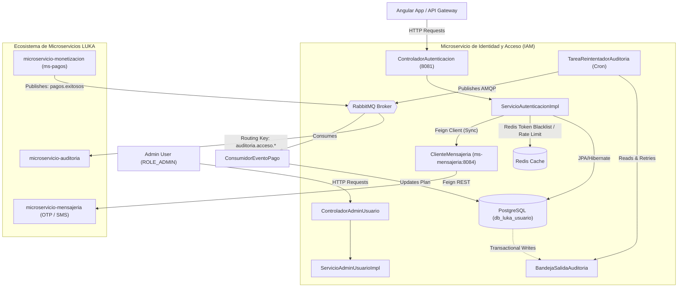

# 🔐 Microservicio de Identidad y Acceso (IAM) - LUKA Platform

> [!NOTE]
> **ESTADO DEL PROYECTO: ESTABLE Y FINALIZADO (PRODUCCIÓN)**  
> Este microservicio ha alcanzado su versión final de diseño y reestructuración arquitectónica. Queda congelado para cambios de lógica interna en el backend, sirviendo como núcleo estable de seguridad y autenticación para el equipo de Frontend dirigido por **Cristina Astocaza**, y los desarrolladores **Gabriel Carazas** y **Paul Bendezu**, bajo la dirección y diseño de arquitectura en la nube de **Paulo Moron**.

Este microservicio gestiona la identidad, el ciclo de vida de los usuarios, las credenciales, el control perimetral de seguridad (bloqueos temporales de IP por fuerza bruta), y la sincronización de planes de suscripción en tiempo real mediante un enfoque modular, tolerante a fallos y basado en eventos para la plataforma SaaS de gestión financiera **LUKA**.

---

## 🏛️ Arquitectura y Principios de Diseño

El servicio ha sido diseñado bajo los principios de **Clean Architecture** (Arquitectura Limpia) y el patrón **DDD (Domain-Driven Design)** a nivel táctico. La modularidad garantiza un acoplamiento mínimo y una alta cohesión:



### Capas del Proyecto:
1. **Dominio (`com.usuario.dominio`):** Contiene las entidades puras de negocio (`Usuario`, `Rol`, `BandejaSalidaAuditoria`), las interfaces de repositorio de JPA y las especificaciones dinámicas (`UsuarioSpecs`).
2. **Aplicación (`com.usuario.aplicacion`):** Define los puertos de entrada (servicios) y salida (clientes HTTP, publicadores), así como los objetos de transferencia de datos estandarizados (`DTOs`).
3. **Infraestructura (`com.usuario.infraestructura`):** Aloja los detalles tecnológicos. Incluye la configuración de seguridad perimetral, caches con Redis, configuración y listeners de RabbitMQ, clientes Feign con resiliencia, y tareas programadas de background.
4. **Presentación (`com.usuario.presentacion`):** Controladores REST que exponen los endpoints bajo un esquema estricto y unificado mediante el objeto de respuesta global `ResultadoApi<T>`.

---

## 🛡️ Características Avanzadas de Seguridad y Resiliencia

El servicio integra mecanismos de seguridad de grado bancario para proteger el ecosistema LUKA:

*   **Autenticación JWT Robusta:** Generación y validación de tokens firmados mediante algoritmo HMAC SHA-384 (`HS384`) que encapsula claims personalizados (ID, email, roles y plan actual).
*   **Manejo de Cierre de Sesión Seguro (Redis Blacklist):** En el `/logout` el token es invalidado de inmediato guardándolo en Redis con un TTL equivalente al tiempo restante de expiración del token.
*   **Filtro Anti-Fuerza Bruta e IP Lockout:** Implementa protección reactiva. Si una IP encadena tres intentos fallidos de inicio de sesión con contraseñas incorrectas, el sistema bloquea automáticamente las solicitudes de esa IP mediante `IpBloqueadaException` y un middleware de control perimetral por un periodo configurable.
*   **Ciclo de Activación OTP Multifactor:** Al registrarse, el usuario queda inactivo (`habilitado = false`) hasta validar su cuenta mediante un código OTP de un solo uso enviado mediante el `ms-mensajeria` por canales de comunicación confiables (Email/SMS/WhatsApp).
*   **Transactional Outbox Pattern (Eventos de Auditoría):**
    *   Para evitar la pérdida de logs de accesos críticos si el broker de mensajería (RabbitMQ) está temporalmente inaccesible, el microservicio escribe los eventos de auditoría en la tabla `bandeja_salida_auditoria` dentro de la misma transacción de negocio.
    *   Un worker en segundo plano (`TareaReintentadorAuditoria`) lee periódicamente los registros pendientes, los publica en RabbitMQ de forma asíncrona, y marca los mensajes procesados al recibir confirmación del broker.
*   **Resiliencia y Circuit Breakers (Feign & Resilience4j):**
    *   Las llamadas síncronas al `ms-mensajeria` están protegidas mediante un cliente Feign con Circuit Breaker y fallback dinámico (`ClienteMensajeriaFallback`), garantizando que fallos externos no degraden la experiencia de registro del usuario.

---

## 🔀 Integración y Topología de RabbitMQ

El microservicio utiliza de forma exclusiva la estructura de mensajería centralizada en la **`libreria-comun`**, asegurando que toda la plataforma comparta las mismas colas y routing keys en su topología:

### 1. Mensajes Publicados (Auditoría de Accesos)
*   **Exchange:** `auditoria.exchange` (Tipo: *Topic*)
*   **Routing Key:** `auditoria.acceso.login` / `auditoria.acceso.logout` / `auditoria.acceso.fallido`
*   **Cola Destino:** `auditoria.accesos.queue`
*   **Tolerancia a Errores:** Enlazada a `auditoria.dlx` (*Direct*) con la cola muerta `auditoria.accesos.dlq` si el procesamiento falla reiteradamente, aplicando un TTL de mensaje de 10 minutos.

### 2. Mensajes Consumidos (Sincronización de Planes)
*   **Cola Escuchada:** `pagos.exitosos.queue` (Enviada desde `ms-monetizacion` / `ms-pagos`).
*   **Procesamiento:** El listener `ConsumidorEventoPago` lee el payload de tipo `EventoPagoExitosoDTO`, actualiza en base de datos la fecha de vigencia y el rol del usuario (`ROLE_PRO` o `ROLE_PREMIUM`) con **ACK Manual** para evitar pérdidas de mensajes si falla la persistencia.

---

## 🚀 Catálogo de Endpoints de la API (v1)

> [!IMPORTANT]
> Todas las respuestas de la API están envueltas de manera uniforme utilizando el contenedor `ResultadoApi<T>` de la librería común, el cual incluye un código de estado de negocio interno, mensaje de respuesta, metadatos de paginación (cuando aplica) y marca de tiempo.

### 1. Autenticación y Gestión de Perfil (`POST /api/v1/auth`)

| Endpoint | Método | Acceso | Descripción | Body / Parámetros |
| :--- | :---: | :---: | :--- | :--- |
| `/registrar` | `POST` | Público | Registra una cuenta nueva inactiva. Envía OTP. | `SolicitudRegistro` (JSON) |
| `/activar/{usuarioId}` | `PUT` | Público | Valida el OTP para activar la cuenta. | `codigoOtp`, `telefono` (Params) |
| `/solicitar-otp/{usuarioId}` | `POST` | Público | Solicita reenvío de OTP de activación. | `SolicitudGenerarOtp` (JSON) |
| `/login` | `POST` | Público | Autentica y retorna Tokens (Access & Refresh JWT). | `SolicitudLogin` (JSON) |
| `/refrescar-token` | `POST` | Público | Renueva el Access Token usando un Refresh Token. | `SolicitudRefreshToken` (JSON) |
| `/logout` | `POST` | Autenticado | Cierra sesión e invalida el JWT en Redis. | *Bearer Token JWT* |
| `/recuperar-solicitar` | `POST` | Público | Inicia el flujo de olvido de contraseña. | `SolicitudRecuperar` (JSON) |
| `/recuperar-confirmar` | `POST` | Público | Restablece contraseña tras validar OTP de olvido. | `registroId`, `codigoOtp` (Params) + `SolicitudRestablecerPassword` (JSON) |
| `/cambiar-password` | `PUT` | Autenticado | Actualiza contraseña desde la cuenta activa. | `SolicitudCambioPassword` (JSON) |
| `/mi-cuenta` | `DELETE` | Autenticado | Desactiva de forma lógica la cuenta actual. | *Bearer Token JWT* |

### 2. Endpoints Administrativos (`/api/v1/admin`)

| Endpoint | Método | Acceso | Descripción | Parámetros de Filtro Paginado |
| :--- | :---: | :---: | :--- | :--- |
| `/usuarios` | `GET` | `ROLE_ADMIN` | Búsqueda y filtrado dinámico de usuarios. | `habilitado` (Boolean), `rol` (String), `texto` (Búsqueda en correo/nombre), `desde` / `hasta` (Rango fecha de creación), `pagina` (default: 0), `tamanio` (default: 10) |

### 3. Sincronización Interna de Datos (`/api/v1/datos-personales`)

| Endpoint | Método | Acceso | Descripción | Parámetros |
| :--- | :---: | :---: | :--- | :--- |
| `/telefono/{usuarioId}` | `PUT` | Interno (Feign) | Sincroniza el número verificado del usuario. | `telefono` (String Param) |

---

## 🛠️ Estructura de Respuesta Estandarizada (`ResultadoApi`)

### Ejemplo de Éxito (`POST /api/v1/auth/login`)
```json
{
  "exitoso": true,
  "codigo": "SUCCESS",
  "mensaje": "Autenticación exitosa.",
  "datos": {
    "accessToken": "eyJhbGciOiJIUzM4NCIsInR5cCI6IkpXVCJ9...",
    "refreshToken": "7c98e25d-3d4f-4a0b-8d1e-efb867c2901b",
    "nombreUsuario": "paulo_dev",
    "roles": ["ROLE_FREE"],
    "planActual": "FREE",
    "fechaFinPlan": null
  },
  "timestamp": "2026-05-17T23:55:00.123456"
}
```

### Ejemplo de Error (`POST /api/v1/auth/login` - IP Bloqueada / Fuerza Bruta)
```json
{
  "exitoso": false,
  "codigo": "IP_BLOQUEADA",
  "mensaje": "Su dirección IP ha sido bloqueada temporalmente por 15 minutos debido a múltiples intentos de inicio de sesión fallidos.",
  "ruta": "/api/v1/auth/login",
  "timestamp": "2026-05-17T23:56:12.987654"
}
```

---


## 🐳 Ejecución y Despliegue

### 1. Compilación
Asegúrate de compilar la `libreria-comun` primero para que las dependencias compartidas estén en el repositorio Maven local:
```bash
# En el directorio raíz de la librería común
mvn clean install

# En el directorio de este microservicio
mvn clean package -DskipTests
```

### 2. Despliegue en Desarrollo Local
Puedes arrancar el servicio localmente asegurando que tienes activos PostgreSQL, Redis y RabbitMQ. Ejecuta:
```bash
mvn spring-boot:run
```

### 3. Dockerización (Producción)
Este repositorio cuenta con un archivo `Dockerfile` optimizado en múltiples etapas (*multi-stage build*) para reducir el tamaño final de la imagen en producción:
```bash
# Compilar imagen de Docker
docker build -t plataforma-luka/microservicio-usuario:latest .

# Ejecutar el contenedor enlazado a la red de microservicios
docker run -d --name luka-iam -p 8081:8081 --network luka-network plataforma-luka/microservicio-usuario:latest
```

---
*Diseñado bajo estándares de calidad continua y arquitectura de microservicios resiliente para **LUKA Financial Platform**.*